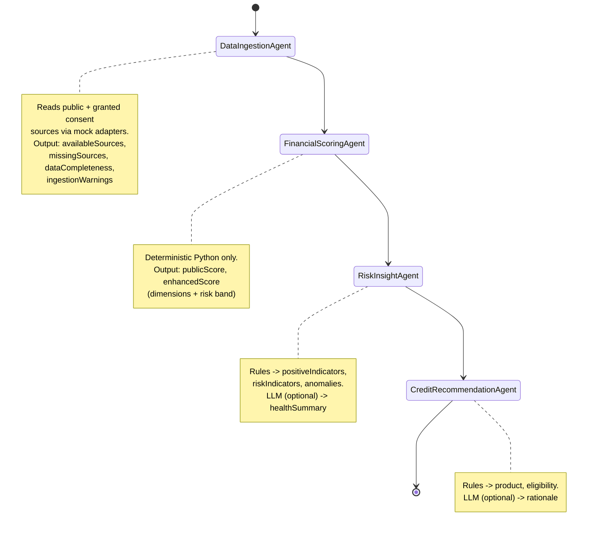

# Architecture

## System Layout

```
┌─────────────────────────────────────────────────────────────────┐
│                        Single Process (uvicorn)                  │
│                                                                   │
│   /            → StaticFiles(frontend/dist)  (production build)  │
│   /api/*       → FastAPI routers                                 │
│                                                                   │
│   ┌───────────────┐   ┌───────────────┐   ┌────────────────┐    │
│   │ routers/       │   │ agents/        │   │ scoring/        │    │
│   │  config        │   │  graph.py      │   │  public_score   │    │
│   │  msme          │──▶│  ingestion     │──▶│  enhanced_score │    │
│   │  dashboard     │   │  scoring_agent │   │  risk_bands     │    │
│   └───────────────┘   │  risk_insight  │   │  loan_eligibility│   │
│           │            │  recommendation│   └────────────────┘    │
│           │            └───────┬───────┘                          │
│           │                    │                                  │
│           ▼                    ▼                                  │
│   ┌───────────────┐   ┌───────────────┐   ┌────────────────┐    │
│   │ data_store.py  │   │ adapters/      │   │ llm/            │    │
│   │  (in-memory,   │   │  gst / upi /   │   │  provider.py    │    │
│   │  loaded once   │◀──│  aa_banking /  │   │  prompts.py     │    │
│   │  at startup)   │   │  epfo          │   │  templates.py   │    │
│   └───────────────┘   └───────────────┘   └────────────────┘    │
│           ▲                                                       │
│           │                                                       │
│   backend/data/*.json  (committed, generated by                   │
│                          scripts/generate_synthetic_data.py)      │
└─────────────────────────────────────────────────────────────────┘

Frontend (dev): Vite dev server (:5173) → proxies /api → backend (:8000)
Frontend (prod): built into frontend/dist, served by the backend at /
```

## LangGraph State Machine



Each node reads and returns a partial update against the shared `AssessmentState` Pydantic model (`backend/app/models/schemas.py`), which is also the single source of truth for the `POST /api/msme/{id}/assess` response shape. Every node appends a `running` and a `completed`/`error` entry to `agentLog`; the SSE endpoint (`GET /api/msme/{id}/assess/stream`) diffs the log after each LangGraph step and emits one `agent_status` event per new entry, followed by a final `final_result` event with the full assembled state.

## Module Boundaries

| Module | Responsibility | Never does |
|---|---|---|
| `app/scoring/*` | All arithmetic: scores, risk bands, eligibility | Call an LLM |
| `app/agents/*` | Orchestrate the pipeline, call scoring + LLM in sequence | Compute a score directly |
| `app/llm/*` | Provider chain, prompt construction, template fallback | Return an un-degraded failure — always falls back |
| `app/adapters/*` | Mock external data sources behind an ABC | Talk to a real external API (yet) |
| `app/data_store.py` | Load committed JSON once at startup, serve in-memory | Write to disk at runtime |
| `app/consent_store.py` | Track simulated consent grants in-memory for the session | Persist across restarts (by design — POC) |
| `app/routers/*` | HTTP surface, request validation, response shaping | Contain scoring or agent logic |

## Mock Adapter Interfaces

Each of `backend/app/adapters/{gst,upi,aa_banking,epfo}.py` defines an abstract base class with a single `fetch(msme_id) -> TypedDict | None` method, and a `Mock*Adapter` implementation that reads from the committed synthetic `consent_financial_signals` data. This is the seam where real integrations would be swapped in without touching the ingestion agent, the scoring engine, or any API contract:

| Adapter | Mock implementation | Real-integration swap |
|---|---|---|
| `GstAdapter` | Reads GST fields from synthetic data | GSTN / GSP (GST Suvidha Provider) API, authenticated via the business's GSTIN and an AA/ULI consent artefact |
| `UpiAdapter` | Reads UPI fields from synthetic data | UPI switch / PSP settlement-data API, or an Account Aggregator "UPI history" FI type |
| `AaBankingAdapter` | Reads banking fields from synthetic data | RBI Account Aggregator (Sahamati) FIP data flow — signed, encrypted FI Data Ranges after customer consent |
| `EpfoAdapter` | Reads EPFO fields from synthetic data | EPFO employer establishment API via DigiLocker/UMANG or a licensed aggregator |

Swapping an adapter means writing a new `Adapter` subclass and wiring it in `app/agents/graph.py::_build_compiled_graph` — no other file changes. The **ULI** and **OCEN** ecosystems are referenced conceptually in the product narrative (§1 of the build spec) as the eventual loan-origination and co-lending rails this assessment would feed into; no adapter code models them directly since they sit downstream of the health-card output, not upstream as a data source.

## LLM Provider Chain

```
PREFERRED_LLM_PROVIDER (default: gemini)
        │
        ▼ (no key / timeout / exception)
  the other provider (groq)
        │
        ▼ (no key / timeout / exception)
  deterministic rule-based template (app/llm/templates.py)
```

Every LLM call is wrapped in `asyncio.wait_for` with a timeout and a broad exception handler that silently degrades to the next link in the chain — the app is always fully functional, even with zero API keys.

## Data Flow Summary

1. `scripts/generate_synthetic_data.py` (fixed seed 42) → `backend/data/*.json` + `.csv` (committed).
2. `DataStore` loads the JSON once at process startup into memory (`app/data_store.py`).
3. A request grants simulated consent → `ConsentStore` (in-memory, per-process).
4. `POST /api/msme/{id}/assess` or `GET .../assess/stream` builds an `AssessmentState`, runs it through the compiled LangGraph, and returns/streams the result.
5. The frontend caches the assembled `AssessmentResponse` per MSME in a React context (`AssessmentContext`) so the Health Card, Recommendation, and Chat screens don't each re-trigger the pipeline (and its LLM calls) independently.
